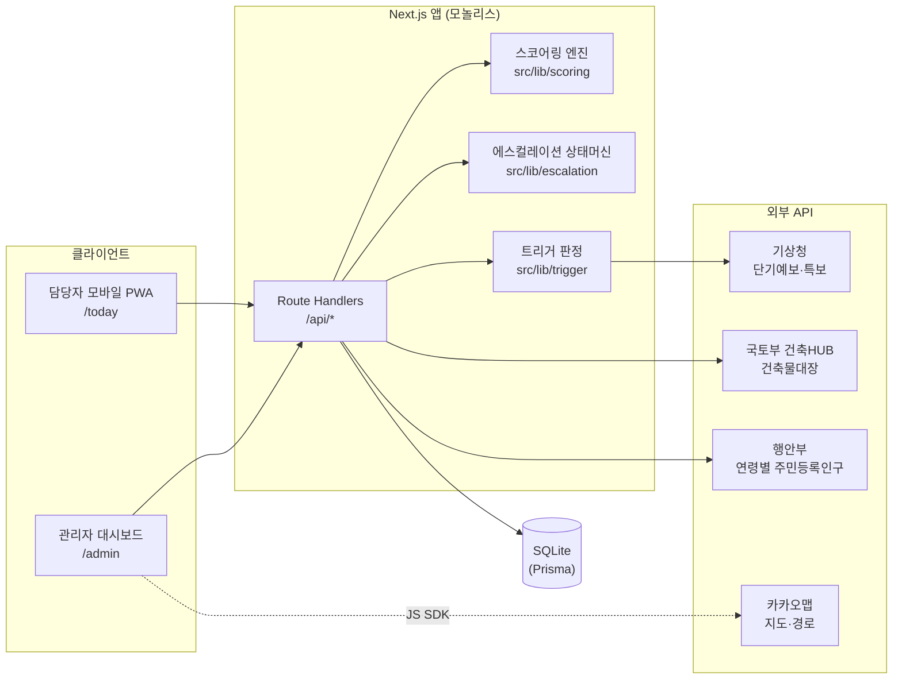
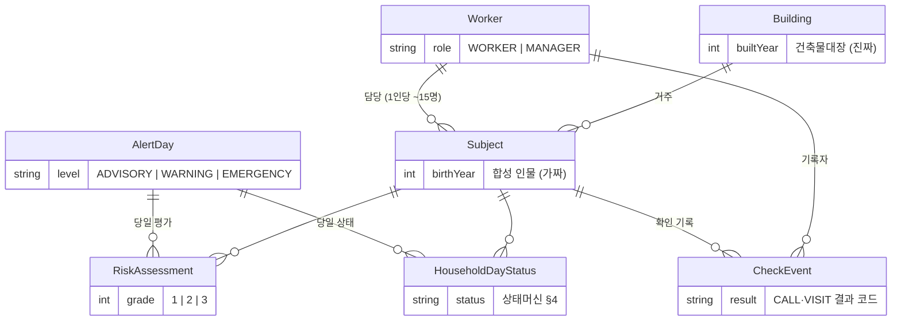
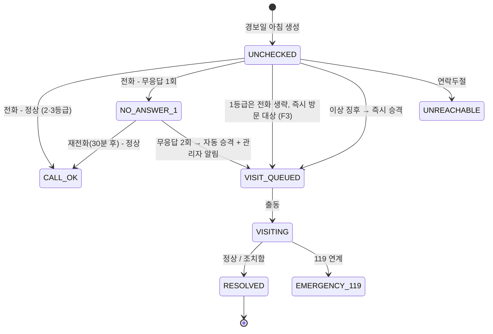

# 아키텍처 개요 — 이 집 먼저

> 이 문서는 **현재 아키텍처의 스냅샷**이다. 결정의 원본과 근거는 [docs/adr/](adr/README.md)에 있으며, 충돌 시 ADR이 우선한다. 제품 요구는 [docs/PRD.md](PRD.md).

## 1. 시스템 구성

Next.js 16 단일 앱(모놀리스, [ADR-0001](adr/0001-nextjs-fullstack-monolith.md))이 담당자 PWA, 관리자 대시보드, API를 모두 담당한다.



## 2. 디렉터리 구조

```
src/
├── app/
│   ├── layout.tsx            # 루트 레이아웃 (ko, PWA 등록)
│   ├── page.tsx              # 홈 (진입점 안내)
│   ├── manifest.ts           # PWA Web App Manifest (ADR-0006)
│   ├── today/                # [예정] 담당자: 오늘의 대응 보드 (F3, F4)
│   ├── admin/                # [예정] 관리자: 관제 대시보드 (F5)
│   └── api/                  # Route Handlers (공공데이터 프록시 포함)
├── components/
│   └── ServiceWorkerRegistrar.tsx
├── lib/
│   ├── domain.ts             # 도메인 상수·타입 (상태값 단일 원본)
│   ├── db.ts                 # Prisma 클라이언트 싱글턴 (driver adapter)
│   ├── bldg-hub/             # 건축HUB 클라이언트·순수 매핑
│   ├── kakao/                # 서버 전용 주소 지오코딩
│   ├── scoring/
│   │   ├── weights.ts        # 가중치 + 출처 주석 (수정은 이 파일에서만)
│   │   ├── score.ts          # 순수 함수 스코어링 엔진 (FR-3)
│   │   └── score.test.ts
│   ├── escalation/initial.ts # 발령 시 가구 상태 결정 (순수) — transition.ts는 예정 (FR-5)
│   ├── public-data/          # 공공데이터포털 공통 클라이언트 + 기상청·인구 (서버 전용)
│   ├── bldg-hub/             # 건축HUB 건축물대장 표제부 클라이언트 + 순수 매핑 (FR-2)
│   ├── kakao/local.ts        # 카카오 로컬 지오코딩 (서버 전용, ADR-0007)
│   └── trigger/              # 3단계 판정(heat) · 발령 오케스트레이션(declare) · 날짜 변환
├── generated/prisma/         # Prisma 생성 클라이언트 (커밋 안 함, postinstall 자동 생성)
prisma/
├── schema.prisma             # 데이터 모델 단일 원본 (ADR-0004)
├── seed.ts                   # 시드 진입점 — 건축HUB·카카오 실호출 (ADR-0012)
└── seed/                     # config(지역·슬롯) · select(순수 선별) · synthetic(합성 인물)
prisma.config.ts              # Prisma 7 설정 (.env 로딩, DATABASE_URL)
public/
└── sw.js                     # 수제 Service Worker (ADR-0006)
```

## 3. 데이터 모델

원본은 [prisma/schema.prisma](../prisma/schema.prisma). SQLite 제약으로 enum이 없으므로 상태값의 유효한 값 집합은 `src/lib/domain.ts`가 정의한다([ADR-0004](adr/0004-sqlite-prisma.md)).



핵심 원칙: **"건물은 진짜, 사람은 가짜"** (PRD §8) — `Building`은 실존 주소의 실제 건축물대장 값, `Subject`는 합성 인물. 실명 개인정보는 어떤 형태로도 저장 금지.

## 4. 에스컬레이션 상태머신 (FR-5)

가구별 × 경보일별 상태. 전이 함수는 `src/lib/escalation/`(예정)의 순수 함수로 구현하고 Vitest로 테스트한다.



- 발령(`/api/trigger` POST)은 `[*] --> UNCHECKED`와 `[*] --> VISIT_QUEUED` 진입 화살표만 담당한다(`escalation/initial.ts`). 같은 날 재발령해도 진행 중인 상태는 보존한다
- 방문 결과 `에어컨 없음·고장`은 상태와 별개로 `Subject.airconBroken` 플래그를 세우고 **익일 위험도에 가중**된다(FR-8) + 지원사업 연계 플래그(FR-11)
- 방문 큐 2건 이상 → 위험도 우선 + 이동시간 최소 순서 제시(FR-7, v0는 카카오 도보 경로 API — [ADR-0007](adr/0007-kakao-map.md))

## 5. 위험도 스코어링 (FR-3)

`위험점수 = W_개인 × W_건물 × W_기상` (PRD §7, [ADR-0005](adr/0005-rule-based-risk-model.md))

- 가중치·컷오프: `src/lib/scoring/weights.ts` — **모든 값에 출처 주석 필수**
- 엔진: `src/lib/scoring/score.ts` — 순수 함수, 점수 + 등급 + **위험 사유(reasons)** 반환
- UI의 위험 사유 카드(F3)는 엔진이 반환한 reasons만 표시한다 (설명 가능성 보장)

## 6. 외부 연동

| 연동 | 용도 | 인증 | env 키 |
|---|---|---|---|
| 기상청 단기예보/특보 (공공데이터포털) | F1 트리거, 기상계수 | 공공데이터포털 서비스 키 (서버 전용) | `PUBLIC_DATA_SERVICE_KEY` |
| 국토부 건축HUB 건축물대장 | FR-2 건물 취약도 | 공공데이터포털 서비스 키 (서버 전용) | `PUBLIC_DATA_SERVICE_KEY` |
| 행안부 행정동별 성·연령별 주민등록 인구수 | 지역 고령밀도 | 공공데이터포털 서비스 키 (서버 전용) | `PUBLIC_DATA_SERVICE_KEY` |
| 카카오맵 JS SDK | F5 지도 | JS 앱 키 (클라이언트) | `NEXT_PUBLIC_KAKAO_MAP_KEY` |
| 카카오 REST (로컬 주소검색·도보 경로) | 지오코딩 + 법정동코드(`b_code` → 건축HUB 조회 키), FR-7 경로 | REST 키 (서버 전용) | `KAKAO_REST_KEY` |

- 서버 전용 키는 절대 `NEXT_PUBLIC_` 접두사를 붙이지 않는다. 외부 호출은 Route Handler를 거쳐 프록시
- 키 목록은 [.env.example](../.env.example) 참조. 실제 키는 커밋 금지

## 7. 라우트 / API (계획 포함)

| 경로 | 역할 | 상태 |
|---|---|---|
| `/` | 진입점 안내 | ✅ 초기화됨 |
| `/today` | 담당자 대응 보드 + 원터치 기록 (FR-4) | 예정 (D1 밤) |
| `/admin` | 관리자 지도 대시보드 (FR-6) | 예정 (D2 오전) |
| `/api/trigger` | `GET` 판정 미리보기 / `POST` 발령 — AlertDay + 당일 평가 + 가구 상태 생성 (FR-1·FR-3) | ✅ 연동됨 |
| `/api/public-data/weather-warnings` | 기상청 기상특보 목록 | ✅ 연동됨 |
| `/api/public-data/buildings` | 건축HUB 표제부 정규화 | ✅ 연동됨 |
| `/api/public-data/population` | 행정동 연령별 인구 정규화 | ✅ 연동됨 |
| `/api/subjects` | 대상자 목록 + 당일 평가 | 예정 (D1) |
| `/api/checks` | 확인 기록 생성 → 상태머신 전이 (FR-5) | 예정 (D1) |
| `/api/visit-queue` | 방문 큐 + 출동 순서 (FR-7) | 예정 (D2) |
| `/api/report` | 일일 보고서 (FR-9) | 예정 (Could) |

## 8. 비기능 구현 방침

- **접근성(담당자 앱)**: 기본 글자 크기 상향, 터치 타깃 최소 48px, 화면당 결정 1개, 기록 완료까지 탭 2회 이내 (PRD §9) — 공용 컴포넌트로 강제
- **알림 침묵 원칙**: 비경보일 알림 0건. 알림 생성은 도메인 로직, 전달은 v0 인앱([ADR-0008](adr/0008-notification-in-app-first.md))
- **PWA**: manifest + 수제 SW([ADR-0006](adr/0006-pwa-manual-service-worker.md)). 오프라인 기록 큐잉은 데모에서 언급만

## 9. PRD 48h 계획 ↔ 모듈 매핑

| PRD §13 | 모듈/디렉터리 |
|---|---|
| D1 오전: 합성 데이터 + API 파이프라인 | `prisma/seed.ts` + `prisma/seed/`, `src/lib/trigger/`, `src/lib/bldg-hub/`, `src/lib/public-data/` |
| D1 오후: 스코어링 + 상태머신 | `src/lib/scoring/` (초기화됨), `src/lib/escalation/` |
| D1 밤: 담당자 모바일 웹 | `src/app/today/` |
| D2 오전: 관리자 대시보드 | `src/app/admin/`, 카카오맵 컴포넌트 |
| D2 오후: 출동 경로 + 리허설 | `/api/visit-queue`, 시뮬레이션 계산 |
