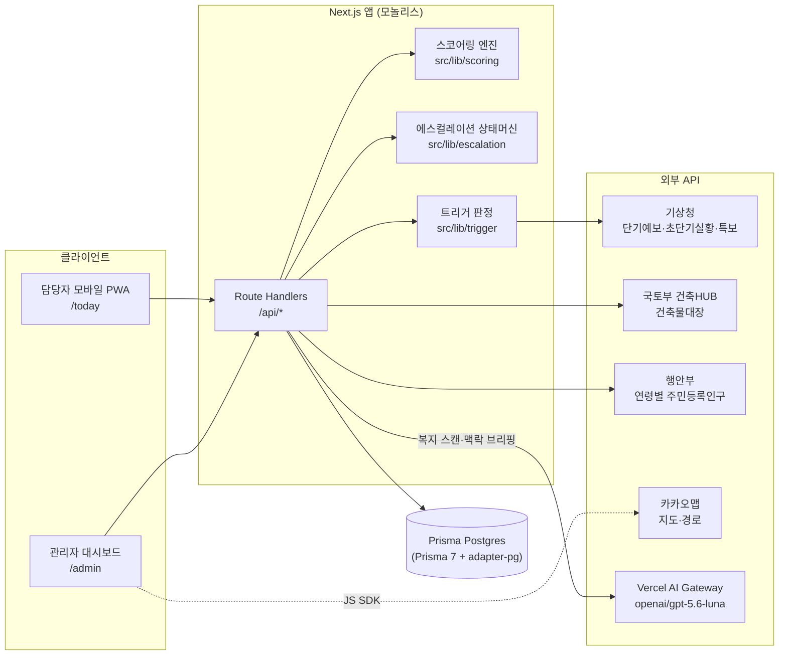
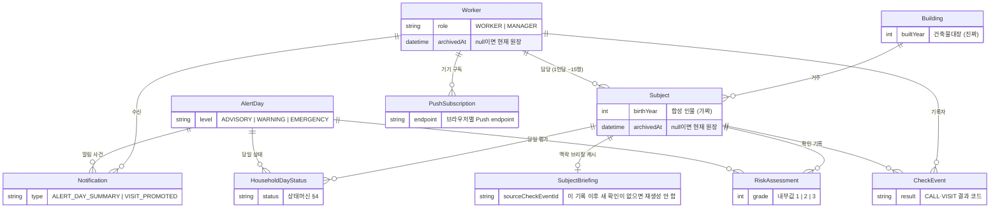
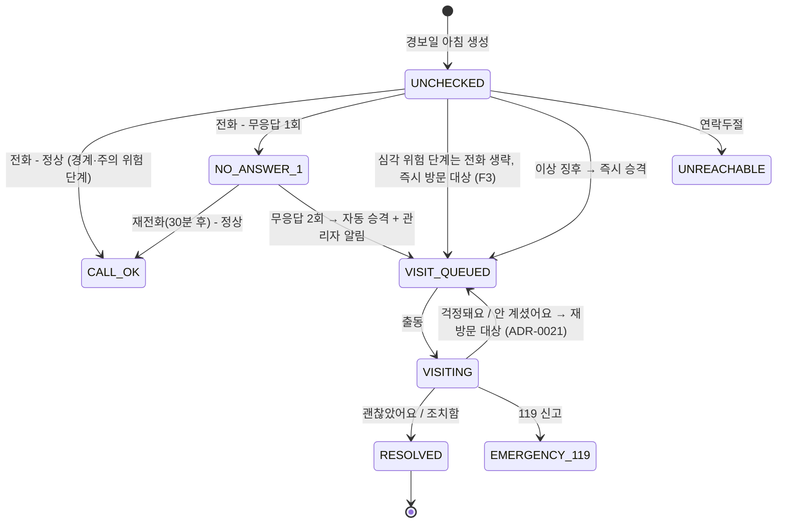

# 아키텍처 개요 — See:Near

> 이 문서는 **현재 아키텍처의 스냅샷**이다. 결정의 원본과 근거는 [docs/adr/](adr/README.md)에 있으며, 충돌 시 ADR이 우선한다. 제품 요구는 [docs/PRD.md](PRD.md).

## 1. 시스템 구성

Next.js 16 단일 앱(모놀리스, [ADR-0001](adr/0001-nextjs-fullstack-monolith.md))이 담당자 PWA, 관리자 대시보드, API를 모두 담당한다.



## 2. 디렉터리 구조

```
src/
├── app/
│   ├── layout.tsx            # 루트 레이아웃 (ko)
│   ├── page.tsx              # 홈 (진입점 안내)
│   ├── today/                # 담당자 화면 + PWA 등록 + [subjectId] 상세·기록 + log(기록 탭) (F3, F4)
│   ├── map/                  # 담당자: 담당 가구 지도 (F5)
│   ├── admin/                # 관리자: 관제 대시보드 (F5) — ✅ 구현됨
│   └── api/                  # Route Handlers (공공데이터 프록시 포함)
├── components/
│   ├── ServiceWorkerRegistrar.tsx
│   ├── today/                # 담당자 화면 컴포넌트 (카드·하단 탭·원터치 기록·아이콘)
│   └── map/                  # 담당자 지도 컴포넌트
├── lib/
│   ├── domain.ts             # 도메인 상수·타입 (상태값 단일 원본)
│   ├── db.ts                 # Prisma 클라이언트 싱글턴 (driver adapter)
│   ├── bldg-hub/             # 건축HUB 클라이언트·순수 매핑
│   ├── kakao/                # 서버 전용 주소 지오코딩
│   ├── scoring/
│   │   ├── weights.ts        # 가중치 + 출처 주석 (수정은 이 파일에서만)
│   │   ├── score.ts          # 순수 함수 스코어링 엔진 (FR-3)
│   │   ├── reasons.ts        # 위험 사유 분류(개인·건물·기상) — 문장은 그대로 둔다
│   │   └── *.test.ts
│   ├── escalation/           # initial(발령 시 진입) · transition(기록 전이, FR-5) — 모두 순수 함수
│   ├── welfare-scan/         # eligibility(순수 규칙 자격 판정) · openai(Luna 신호 추출, FR-11)
│   ├── briefing/             # 맥락 브리핑 (FR-12) — 마스킹·모델 호출·근거 대조. 스코어링과 데이터가 겹치지 않는다
│   ├── board/                # today.ts(보드 — /today·/api/subjects 공유) · subject.ts(상세) · log.ts(기록 탭 화면 모델) · log-read.ts(조회) · format.ts(날짜·나이·동)
│   ├── http.ts               # 앱 API 공통 오류·검증 헬퍼
│   ├── public-data/          # 공공데이터포털 공통 클라이언트 + 기상청(예보·초단기실황·특보)·인구 (서버 전용)
│   ├── bldg-hub/             # 건축HUB 건축물대장 표제부 클라이언트 + 순수 매핑 (FR-2)
│   ├── kakao/local.ts        # 카카오 로컬 지오코딩 (서버 전용, ADR-0007)
│   └── trigger/              # 3단계 판정(heat) · 발령 오케스트레이션(declare) · 날짜 변환
├── generated/prisma/         # Prisma 생성 클라이언트 (커밋 안 함, postinstall 자동 생성)
prisma/
├── schema.prisma             # 데이터 모델 단일 원본 (ADR-0013)
├── migrations/               # 마이그레이션 이력 — 배포는 prisma migrate deploy
├── seed.ts                   # 시드 진입점 — 건축HUB·카카오 실호출 (ADR-0012)
└── seed/                     # config(지역·슬롯) · select(순수 선별) · synthetic(합성 인물)
prisma.config.ts              # Prisma 7 CLI 설정 (.env 로딩, DIRECT_URL)
public/
├── today.webmanifest          # /today 설치 진입점, navigation scope는 /map 포함 `/` (ADR-0006)
└── sw.js                     # 루트 등록, 페이지 캐시는 /today 한정 (ADR-0006·0017)
```

## 3. 데이터 모델

원본은 [prisma/schema.prisma](../prisma/schema.prisma). 상태값은 String 컬럼이고 유효한 값 집합은 `src/lib/domain.ts`의 상수·가드가 정의한다([ADR-0013](adr/0013-prisma-postgres.md)). 스키마 변경은 `prisma/migrations/`에 파일로 남는다.



핵심 원칙: **"건물은 진짜, 사람은 가짜"** (PRD §8) — `Building`은 실존 주소의 실제 건축물대장 값, `Subject`는 합성 인물. 실명 개인정보는 어떤 형태로도 저장 금지.

`Worker`·`Subject`·`Building`은 경보와 무관한 영구 원장이다. 현재 관리 대상은 `archivedAt IS NULL`이며, 관리자 보관 작업은 행을 삭제하지 않고 `archivedAt`만 기록한다. 따라서 과거 경보·점검 이력의 외래키 관계는 유지된다([ADR-0022](adr/0022-permanent-roster-alert-snapshot-separation.md)).

`SubjectBriefing`은 `CheckEvent` 이력에서 생성한 맥락 브리핑의 캐시다(FR-12). 대상자당 최대 한 행이며 생성 근거가 된 최신 `CheckEvent.id`를 함께 들고 있어, 그 뒤로 새 확인 기록이 없으면 모델을 다시 부르지 않는다. 파생 데이터이므로 지워도 다음 열람에서 다시 만들어진다 — 원장은 `CheckEvent`다([ADR-0024](adr/0024-subject-context-briefing.md)).

`AlertDay`가 없는 날짜에도 활성 생활지원사·대상자 원장은 항상 조회한다. `RiskAssessment`·`HouseholdDayStatus`·`CheckEvent`는 경보일별 스냅샷이므로 해당 날짜에 행이 없으면 관리자 원장 화면은 위험 단계·상태를 복사하지 않고 `경보 없음`으로 표시한다. 새 경보·신규 점검·기본 담당자/관리자 선택에서는 보관 원장을 제외하지만, 명시 ID로 여는 과거 상세와 기존 경보 스냅샷은 보존한다.

## 4. 에스컬레이션 상태머신 (FR-5)

가구별 × 경보일별 상태. 전이 함수는 `src/lib/escalation/`(예정)의 순수 함수로 구현하고 Vitest로 테스트한다.



- 발령(`/api/trigger` POST)은 `[*] --> UNCHECKED`와 `[*] --> VISIT_QUEUED` 진입 화살표만 담당한다(`escalation/initial.ts`). 같은 날 재발령해도 진행 중인 상태는 보존한다
- 방문 결과 `에어컨 없음·고장`은 상태와 별개로 `Subject.airconBroken` 플래그를 세우고 **익일 위험도에 가중**된다(FR-8) + 지원사업 연계 플래그(FR-11). 전화·방문 화면이 함께 받는 `coolingStatus`도 같은 두 필드로 들어간다([ADR-0021](adr/0021-visit-record-flow.md))
- 방문 결과 `걱정돼요`·`안 계셨어요`는 가구를 방문 큐에 그대로 남긴다 — 그날 대응이 끝나지 않았으므로 미처리 수에서 빠지지 않는다([ADR-0021](adr/0021-visit-record-flow.md))
- 방문 큐 2건 이상 → 위험 단계 우선 제약 안에서 실제 차량 도로거리 합이 가장 짧은 순서 제시(FR-7, 카카오모빌리티 자동차 길찾기 — [ADR-0018](adr/0018-kakao-driving-shortest-route.md))

## 5. 위험도 스코어링 (FR-3)

`위험점수 = W_개인 × W_건물 × W_기상` (PRD §7, [ADR-0005](adr/0005-rule-based-risk-model.md))

- 가중치·컷오프: `src/lib/scoring/weights.ts` — **모든 값에 출처 주석 필수**
- 엔진: `src/lib/scoring/score.ts` — 순수 함수, 점수 + 위험 단계 + **위험 사유(reasons)** 반환
- UI의 위험 사유 카드(F3)는 엔진이 반환한 reasons만 표시한다 (설명 가능성 보장)

### 5-b. 맥락 브리핑 (FR-12) — 스코어링과 분리된 경로

`CheckEvent` 이력에서 대면 전 한 줄, 인수인계 3줄, 최근 기록별 대화 요약을 만든다(PRD F6, [ADR-0024](adr/0024-subject-context-briefing.md)). **위험도 경로와 아무것도 공유하지 않는 것이 이 설계의 요점이다.**

| | 위험도 (§5) | 맥락 브리핑 (5-b) |
|---|---|---|
| 답하는 질문 | 누구부터 확인할까 | 만나서 무엇을 확인할까 |
| 입력 | 대상자·건물 속성 + 당일 기상 | `CheckEvent` 이력(결과 + 메모) |
| 판단 주체 | `scoring/` 순수 규칙 엔진 | 외부 모델 + 서버 근거 대조 |
| 출력이 닿는 곳 | `RiskAssessment.score`·`grade`·`reasons` | `SubjectBriefing`, 화면의 별도 탭·기록 상세 모달 |
| 실패했을 때 | 발령 자체가 실패 | 브리핑 영역만 사라지고 기록 원문은 그대로 |

- **AI는 `RiskAssessment`에 쓰지도 읽지도 않는다.** 점수·순서는 계속 [ADR-0005](adr/0005-rule-based-risk-model.md)의 규칙 엔진이 단독으로 정한다
- **근거 대조**: 모델은 문장마다 `sourceCheckEventId`를 함께 낸다. 서버가 그 행이 실재하고 **해당 대상자의 것인지** 확인하고, 통과 못한 문장은 버린다. 화면의 근거 문구(날짜·확인 종류·결과)는 모델 출력이 아니라 DB 행에서 만든다 — 위험 사유를 UI가 재작성하지 않는 원칙(AGENTS.md 도메인 규칙 3)과 같다
- **개인정보 경계**: 담당자가 그 대상자를 열었을 때 **1명분만** 보낸다. 전송 전 서버가 메모에서 이름·전화·주소·기관명 패턴을 지우고, 대상자 식별자는 요청마다 새로 만드는 임시 별칭을 쓴다. `Subject.id`·이름·연락처·주소·담당자 이름은 보내지 않는다. `store: false` + strict Structured Outputs. 관리자 일괄 배치는 하지 않는다
- **알림을 만들지 않는다** — `Notification` 행을 생성하지 않는다(도메인 규칙 4)
- reasoning effort는 `medium`이다. 담당자가 화면을 여는 동안 기다리는 호출이라 지연이 비싸다 — 관리자가 수동 실행하는 복지 스캔(`high`)과 다른 선택이다

구현 배치는 이렇다. **근거 대조는 DB를 모르는 순수 함수**(`evidence.ts`)라 prisma 목 없이 검사한다 —
이 기능의 안전장치이므로 검사되지 않은 채 바뀌는 자리에 두지 않는다.

| 조각 | 위치 | 하는 일 |
|---|---|---|
| 마스킹·별칭 | `lib/briefing/privacy.ts` | 전송 전 이름·전화·주소·기관 고유명 제거 + `CheckEvent.id` → `event-1` 별칭 |
| 모델 호출 | `lib/briefing/openai.ts` | AI Gateway Responses + strict Structured Outputs 파싱 |
| 근거 대조 | `lib/briefing/evidence.ts` | 그 대상자의 기록인지 확인 · 근거 문구 생성 · 저장 모양 변환 |
| 캐시·조회 | `lib/briefing/service.ts` | 최신 기록 id 비교 → 재생성 여부 결정. DB만 맡는다 |
| 조회 경로 | `app/api/subjects/[subjectId]/briefing/route.ts` | 유일한 조회 경로. 클라이언트는 모델을 직접 부르지 않는다 |
| 화면 | `SubjectBriefingCard`(상세) · `SubjectInformationTabs`(정보 탭·기록 상세) · `ConversationSuggestions`(전화 안내) | 페이지가 먼저 뜨고 브리핑만 나중에 채워진다 (`useSubjectBriefing`) |
| 입력 시드 | `prisma/seed/history.ts` | 과거 경보일 3일 + 대상자별 합성 확인 기록 (브리핑의 유일한 입력) |

산출물 상한은 전부 `domain.ts` 상수다 — `BRIEFING_MAX_LINES`(3) · `CONVERSATION_SUGGESTION_MAX`(2) ·
`CONVERSATION_SUMMARY_MAX`(3) · `CONVERSATION_ONGOING_MAX`(3). 모델 스키마와 화면이 같은 값을 읽는다.

## 6. 외부 연동

| 연동 | 용도 | 인증 | env 키 |
|---|---|---|---|
| 기상청 단기예보·초단기실황·특보 (공공데이터포털) | F1 트리거·기상계수·현재 날씨 | 공공데이터포털 서비스 키 (서버 전용) | `PUBLIC_DATA_SERVICE_KEY`, `KMA_GRID_NX`, `KMA_GRID_NY` |
| 국토부 건축HUB 건축물대장 | FR-2 건물 취약도 | 공공데이터포털 서비스 키 (서버 전용) | `PUBLIC_DATA_SERVICE_KEY` |
| 행안부 행정동별 성·연령별 주민등록 인구수 | 지역 고령밀도 | 공공데이터포털 서비스 키 (서버 전용) | `PUBLIC_DATA_SERVICE_KEY` |
| 한국사회보장정보원 중앙부처 복지서비스 | FR-11 복지 스캔 사업 검색 | 공공데이터포털 서비스 키 (서버 전용) | `PUBLIC_DATA_SERVICE_KEY` |
| 카카오맵 JS SDK | F5 지도 | JS 앱 키 (클라이언트) | `NEXT_PUBLIC_KAKAO_MAP_KEY` |
| 카카오 REST (로컬 주소검색·자동차 경로) | 지오코딩 + 법정동코드(`b_code` → 건축HUB 조회 키), FR-7 차량 최단 경로 | REST 키 (서버 전용) | `KAKAO_REST_KEY` |
| Vercel AI Gateway Responses API (`openai/gpt-5.6-luna`, high) | FR-11 설비 사실·비식별 현장 용어의 문제 신호 분류 | Vercel OIDC / 로컬 Gateway 키 (서버 전용) | `VERCEL_OIDC_TOKEN`(자동), `AI_GATEWAY_API_KEY`(로컬) |
| Vercel AI Gateway Responses API (`openai/gpt-5.6-luna`, medium) | FR-12 마스킹된 확인 기록 → 맥락 브리핑 (1명 단위 온디맨드) | 같음 | 같음 |

- 서버 전용 키는 절대 `NEXT_PUBLIC_` 접두사를 붙이지 않는다. 외부 호출은 Route Handler를 거쳐 프록시
- 키 목록은 [.env.example](../.env.example) 참조. 실제 키는 커밋 금지
- 현재 날씨는 `/api/public-data/current-weather`가 기상청 `getUltraSrtNcst`의 `T1H`와 `REH`를 받아 기존 여름철 체감온도 산식으로 현재 기온·현재 체감온도를 계산한다. 서버 fetch 캐시는 600초(10분)다.
- 현재 관측 체감온도와 경보 발령 시 저장하는 `AlertDay.feelsLikeMax`(단기예보의 당일 최고 체감온도)는 별도 값이다. 이번 연동은 기존 Route Handler·공공데이터 클라이언트를 확장하며 새 의존성·Prisma 스키마·ADR을 추가하지 않는다.

## 7. 라우트 / API (계획 포함)

| 경로 | 역할 | 상태 |
|---|---|---|
| `/` | 진입점 안내 | ✅ 초기화됨 |
| `/today` | 담당자 대응 보드 — 경보일 위험 단계별 목록 / 비경보일 담당 가구 명단 (FR-4) | ✅ 구현됨 |
| `/today/[subjectId]` | 대상자 상세 + 원터치 전화·방문 결과 기록, `?view=info`는 카드 chevron의 읽기 전용 정보 (FR-4·FR-5) | ✅ 구현됨 |
| `/today/log` | 담당자 확인 기록 목록 — 선택한 담당자의 CheckEvent (읽기 전용) | ✅ 구현됨 |
| `/map` | 담당자 담당 가구 지도 | ✅ 구현됨 |
| `/admin` | 관리자 지도 대시보드·건물별 카카오 오버레이 (FR-6) | ✅ 구현됨 |
| `/admin/welfare-scan` | 관리자 복지 스캔·자격 검토 (FR-11) | ✅ 구현됨 |
| `/api/welfare-scan` | `POST` 대상자 설비·비식별 기록 분석·자격 비교 / `GET` 최신 복지사업 연결 확인 | ✅ 연동됨 |
| `/api/trigger` | `GET` 판정 미리보기 / `POST` 발령 — AlertDay + 당일 평가 + 가구 상태 생성 (FR-1·FR-3) | ✅ 연동됨 |
| `/api/public-data/weather-warnings` | 기상청 기상특보 목록 | ✅ 연동됨 |
| `/api/public-data/current-weather` | 기상청 초단기실황 현재 기온·현재 체감온도(10분 서버 캐시) | ✅ 연동됨 |
| `/api/public-data/buildings` | 건축HUB 표제부 정규화 | ✅ 연동됨 |
| `/api/public-data/population` | 행정동 연령별 인구 정규화 | ✅ 연동됨 |
| `/api/subjects` | 대상자 목록 + 당일 평가 (보드 조회, `/today`와 동일 함수) | ✅ 구현됨 |
| `/api/checks` | 확인 기록 생성 → 상태머신 전이 (FR-5) | ✅ 구현됨 |
| `/api/push-subscriptions` | 담당자·관리자 Web Push 구독 등록·해지 | ✅ 구현됨 |
| `/api/notifications/dispatch` | 오전 8시 예약·실패 재시도 Push 발송 | ✅ 구현됨 |
| `/api/visit-queue` | 방문 큐 + 위험 단계 우선 차량 최단 순서 + 카카오 자동차 경로·예상시간 (FR-7) | ✅ 구현됨 |
| `/api/subjects/[subjectId]/briefing` | `GET` 대상자 맥락 브리핑 — 새 확인 기록이 없으면 캐시 반환 (FR-12) | ✅ 구현됨 |
| `/api/report` | 일일 보고서 (FR-9) | 예정 (Could) |

## 8. 비기능 구현 방침

- **접근성(담당자 앱)**: 기본 글자 크기 상향, 터치 타깃 최소 48px, 화면당 결정 1개, 기록 완료까지 탭 2회 이내 (PRD §9) — 공용 컴포넌트로 강제. 보드 카드 버튼(탭 1) → 상세의 결과 버튼(탭 2)이 기록 경로다
- **담당자 화면 디자인**: Figma `junction` ①(`8:1803`)·①-b(`14:2926`)·②(`3:505`)를 따른다. 담당자·공용 Tailwind 화면의 색·글자는 `src/app/globals.css`의 2층 디자인 토큰(Primitive → Semantic, Figma `02 · Foundations` `16:25`)을 쓰고 Semantic 층만 만진다 ([ADR-0015](adr/0015-design-system-tokens.md)). 관리자 CSS Module은 기존 `tokens.css`의 `--admin-*` 체계를 유지하고 위험 단계 색만 전역 Semantic 토큰을 공유한다. 아이콘은 인라인 SVG(`src/components/today/icons.tsx`). **문구는 `src/lib/domain.ts` 상수를 쓰며 디자인과 의도적으로 다른 지점이 있다** — 근거와 목록은 [ADR-0014](adr/0014-figma-design-with-domain-terms.md)
- **하단 탭(오늘·방문 동선)**: 오늘(`/today`)·방문 동선(`/map`) 탭이 활성이고, 기록(`/today/log`) 화면은 탭에서 제외됐다([ADR-0014](adr/0014-figma-design-with-domain-terms.md)). 탭 왕복은 `date`·`workerId` 검색 문맥을 유지하며, manifest navigation scope(`/`)가 두 탭을 모두 포함한다
- **알림 침묵 원칙**: 비경보일 알림 0건. 경보일은 담당자별 아침 요약 1건과 방문 승격만 `Notification`에 저장하고 인앱 피드·Web Push가 함께 쓴다. 단, 관제 센터의 수동 경보 버튼은 명시적인 재전송 요청이므로 같은 요약 원장을 다시 발송 가능하게 연다([ADR-0017](adr/0017-notification-events-web-push.md))
- **PWA**: manifest + 수제 SW([ADR-0006](adr/0006-pwa-manual-service-worker.md), [ADR-0017](adr/0017-notification-events-web-push.md)). 알림을 위해 SW scope는 `/`, 페이지 이동 캐시는 `/today`로 제한하고 공용 정적 자원만 함께 캐시한다. 오프라인 기록 큐잉은 데모에서 언급만
- **배포**: Vercel([ADR-0013](adr/0013-prisma-postgres.md)) — `vercel-build`가 direct 연결(`DIRECT_URL`)로 `prisma migrate deploy` 후 빌드하고, 런타임은 pooled 연결(`DATABASE_URL`)을 쓴다. 데모 진행은 여전히 로컬 실행이 기본이고([ADR-0011](adr/0011-deploy-local-demo-first.md)) 배포 URL은 심사위원 접속용 보조 경로다. 절차는 [docs/deploy-vercel.md](deploy-vercel.md)

## 9. PRD 48h 계획 ↔ 모듈 매핑

| PRD §13 | 모듈/디렉터리 |
|---|---|
| D1 오전: 합성 데이터 + API 파이프라인 | `prisma/seed.ts` + `prisma/seed/`, `src/lib/trigger/`, `src/lib/bldg-hub/`, `src/lib/public-data/` |
| D1 오후: 스코어링 + 상태머신 | `src/lib/scoring/` (초기화됨), `src/lib/escalation/` |
| D1 밤: 담당자 모바일 웹 | `src/app/today/` |
| D2 오전: 관리자 대시보드 (완료) | `src/app/admin/`, 카카오맵 컴포넌트·건물별 오버레이 |
| D2 오후: 출동 경로 + 리허설 | `/api/visit-queue`, 시뮬레이션 계산 |

## 10. 알려진 문제

| 문제 | 영향 | 현재 대응 |
|---|---|---|
| `POST /api/trigger`가 콜드 커넥션에서 Prisma 인터랙티브 트랜잭션 5초 제한을 넘겨 500 (`A commit cannot be executed on an expired transaction`) | 그날 첫 발령이 실패한다. **데모 첫 시연에서 바로 터질 수 있다** | 재시도하면 성공. `declareTrigger`의 `$transaction`에 `timeout` 상향 또는 대상자별 쓰기를 트랜잭션 밖으로 빼는 것이 근본 대응 |
| 통화 음성 파일 첨부(Figma 163:3468 · 164:9043)가 화면에만 있고 저장되지 않는다 | 담당자가 붙인 파일이 `저장하기`로 서버에 올라가지 않는다. 데모에서는 첨부 화면만 보여 준다 | 음성은 어르신의 육성이라 저장소·전사 도입과 개인정보 경계를 정하는 ADR이 선행이다. ADR-0024가 정한 경계는 텍스트 메모까지다 ([ADR-0014](adr/0014-figma-design-with-domain-terms.md) 결과 9) |
| 비경보일에는 가구 확인 기록을 남길 수 없다 | ①-b 화면의 `연락 완료` 칩·`3 / 15` 요약을 구현하지 못함 | 명단만 표시하고 전화는 `tel:`로 바로 건다. 저장하려면 `HouseholdDayStatus`를 `AlertDay`에서 분리해야 하며 별도 ADR 필요 ([ADR-0014](adr/0014-figma-design-with-domain-terms.md)) |
