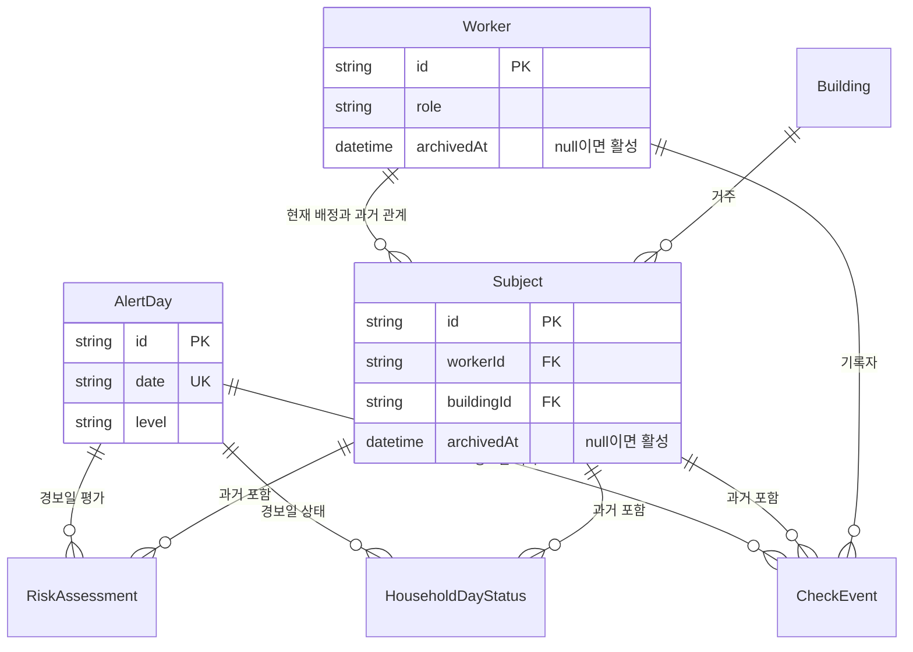

# 상시 생활지원사·대상자 원장 분리 설계

## 배경

현재 Prisma 모델에서 `Worker`, `Subject`, `Building`은 날짜와 무관한 영구 데이터지만, 관리자 조회 모델과 화면은 선택 날짜에 `AlertDay`가 없으면 `subjects: []`를 반환하고 관리 패널 전체를 숨긴다. 이 때문에 8월 22일 경보 스냅샷이 있던 화면에서 8월 23일 비경보 화면으로 넘어가면 대상자가 삭제된 것처럼 보인다.

또한 관리자 삭제 동작은 `Subject`를 지우기 전에 `RiskAssessment`, `HouseholdDayStatus`, `CheckEvent`까지 실제 삭제한다. 원장 관리와 과거 관제 기록 보존이 분리되어 있지 않다.

이 문서는 기존 [관리자 관제 대시보드 설계](2026-08-22-admin-dashboard-design.md)의 "비경보일에는 빈 상황만 반환" 결정을 대체한다.

## 목표

- 경보 유무와 관계없이 활성 생활지원사와 대상자 목록을 `/admin`에서 항상 조회·관리한다.
- 날짜별 위험도·대응 상태는 상시 원장과 분리된 스냅샷으로 유지한다.
- 대상자나 생활지원사를 관리 목록에서 제거해도 과거 위험평가·상태·확인 기록은 보존한다.
- 기존 경보 발령, 알림 침묵 원칙, 스코어링, 상태머신 동작을 바꾸지 않는다.

## 비목표

- 비경보일 전화·방문 결과 기록
- 관리자 인증·권한 체계
- 과거 보관 대상자를 복원하는 별도 UI
- 건물 원장의 보관 처리
- 개발용 `npm run db:seed`의 전체 초기화 동작 변경
- 새 라이브러리나 저장소 도입

## 설계 선택

### 선택: 영구 원장 + 선택적 경보 스냅샷

기존 `Worker`, `Subject`, `Building`을 상시 원장으로 유지하고 `archivedAt`만 추가한다. `AlertDay`, `RiskAssessment`, `HouseholdDayStatus`, `CheckEvent`는 경보일 스냅샷으로 유지한다.

관리자 서버 모델은 두 데이터 집합을 명시적으로 분리한다.

1. `roster`: 선택 날짜와 무관한 활성 생활지원사·대상자 원장
2. `alertSubjects`, `buildings`, `summary`: 선택 날짜에 `AlertDay`가 있을 때만 존재하는 관제 스냅샷

비경보일에도 `roster`는 채워지고 경보 스냅샷만 비어 있다. 화면은 관리 패널을 항상 렌더링하고, 지도·관제 요약만 경보 여부에 따라 렌더링한다.

### 기각한 대안

- **조회 코드만 수정:** 대상자는 다시 보이지만 현재의 물리 삭제가 과거 기록까지 제거하는 문제를 남긴다.
- **`CareDay`·`SubjectDay` 도입:** 비경보일 기록까지 지원할 때 필요한 구조다. 이번 요구는 상시 원장 관리이며, 새 날짜 엔터티와 전체 상태머신 마이그레이션은 불필요하다.
- **경보 스냅샷을 다음 날 복제:** 전날 위험도와 상태를 오늘 데이터처럼 보이게 해 날짜별 사실성을 깨뜨린다.

## 데이터 모델



Prisma 변경은 다음 두 필드와 조회 인덱스뿐이다.

```prisma
model Worker {
  archivedAt DateTime?

  @@index([role, archivedAt])
}

model Subject {
  archivedAt DateTime?

  @@index([workerId, archivedAt])
}
```

마이그레이션은 nullable 컬럼과 인덱스만 추가한다. 기존 행은 모두 `archivedAt = NULL`이므로 활성 상태로 보존되며 데이터 삭제·백필은 없다.

## 조회 계약

관리자 조회 모델은 다음 경계를 갖는다.

```ts
interface AdminRosterWorker {
  id: string;
  name: string;
  phone: string | null;
  subjectCount: number;
}

interface AdminRosterSubject {
  subjectId: string;
  name: string;
  phone: string | null;
  birthYear: number;
  workerId: string;
  workerName: string;
  buildingId: string;
  address: string;
}

interface AdminDashboardBase {
  date: string;
  roster: {
    workers: AdminRosterWorker[];
    subjects: AdminRosterSubject[];
  };
}
```

- `getAdminDashboard()`는 `AlertDay` 조회와 별개로 활성 원장을 항상 조회한다.
- 원장 조회는 `archivedAt: null`인 `WorkerRole.WORKER`와 `Subject`만 포함한다.
- `workerId`와 대상자 이름 검색은 원장과 경보 스냅샷에 동일하게 적용한다.
- 경보 스냅샷은 기존처럼 해당 날짜 `AlertDay`에 연결된 평가·상태만 사용한다.
- 보관된 대상자는 현재 원장과 새 경보 발령에서 제외하지만 기존 상세 URL과 과거 기록에서는 계속 조회할 수 있다.
- 보관된 생활지원사는 기본 담당자 선택, 관리자 현재 목록, 새 알림 수신자에서 제외한다.

## 화면 동작

`/admin`은 경보 여부와 무관하게 다음을 항상 표시한다.

- 대상자 등록과 생활지원사 등록
- 대상자 관리 목록
- 생활지원사 관리 목록
- 이름·담당자 검색

경보일에만 다음을 추가한다.

- 관제 요약
- 위험 지도와 건물별 현황
- 위험 단계·가구 상태·위험 사유
- 경보 알림 피드

비경보일 대상자 행의 위험 단계와 상태는 전날 값을 복제하지 않고 `경보 없음`으로 표시한다.

## 보관 처리

### 대상자

현재 `deleteSubject`의 연쇄 물리 삭제를 제거하고 `archivedAt = now()`만 갱신한다. `RiskAssessment`, `HouseholdDayStatus`, `CheckEvent`, `Notification`은 수정하거나 삭제하지 않는다.

### 생활지원사

활성 대상자가 배정되어 있으면 보관을 거부한다. 활성 대상자가 없으면 과거 `CheckEvent` 유무와 관계없이 `archivedAt = now()`로 보관한다. 과거 기록의 기록자 관계는 유지된다.

보관 작업은 존재하지 않거나 이미 보관된 ID를 받으면 명시적인 한국어 오류를 반환한다.

## 생성·발령 규칙

- 새 생활지원사와 대상자는 `archivedAt = NULL`로 생성된다.
- 기본 담당자 선택과 `/today` 명단은 활성 생활지원사·대상자만 사용한다.
- `POST /api/trigger`는 활성 대상자만 평가해 새 `RiskAssessment`와 `HouseholdDayStatus`를 만든다.
- 과거 경보일 재조회는 당시 평가에 포함된 보관 대상자도 그대로 표시한다.
- 관리자 알림 대상은 활성 관리자·생활지원사만 포함한다.

## 오류와 데이터 무결성

- 존재하지 않는 `workerId` 필터는 다른 담당자의 원장을 대신 보여주지 않고 빈 결과를 반환한다.
- 활성 대상자가 있는 생활지원사는 먼저 재배정하거나 대상자를 보관해야 한다.
- 물리 삭제 API는 제공하지 않는다. 해커톤 개발용 전체 초기화는 기존 시드 명령으로만 가능하다.
- 경보 스냅샷 행의 외래키는 그대로 유지해 과거 원장 참조가 끊기지 않게 한다.

## 변경 범위

- `prisma/schema.prisma`와 새 Prisma 마이그레이션
- `src/lib/admin/dashboard.ts`의 상시 원장 조회 계약
- `src/app/admin/page.tsx`와 관리자 관리 컴포넌트의 조건부 렌더링
- `src/app/admin/actions.ts`의 물리 삭제를 보관 처리로 변경
- `/today`, 상세, 발령, 알림의 활성 원장 필터
- 관련 Vitest 테스트
- `docs/architecture.md`, ADR-0022, `docs/adr/README.md`

## 테스트와 완료 조건

### 데이터·서버 모델

- `AlertDay`가 없는 날짜에도 활성 생활지원사와 대상자 원장을 반환한다.
- 경보일에는 동일 원장에 당일 위험도·상태가 함께 표시된다.
- 보관 대상자는 현재 원장과 새 발령에서 제외된다.
- 보관 전 생성된 위험평가·상태·확인 기록은 그대로 조회된다.
- 대상자 보관이 과거 기록을 삭제하지 않는다.
- 활성 대상자가 있는 생활지원사 보관은 거부된다.

### 화면

- `/admin?date=2026-08-23`에 경보가 없어도 대상자·생활지원사 관리 목록이 보인다.
- `/admin?date=2026-08-22`의 기존 경보 관제 데이터가 그대로 보인다.
- 비경보일에는 위험 지도와 위험 수치를 만들지 않는다.
- 보관 처리 후 현재 목록에서는 사라지지만 과거 경보 상세 링크는 열린다.

### 검증 명령

- `npx prisma validate`
- `npx prisma generate`
- `npm test`
- `npm run lint`
- `npm run build`
